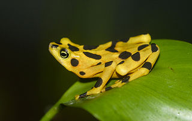

# Frog Or Toad
Machine Learning code to predict if a picture is a Frog or a Toad

_tight_crop.jpeg)[^1] [^2]

[^1]: Image from https://en.wikipedia.org/wiki/Toad.
[^2]: Image from https://en.wikipedia.org/wiki/Panamanian_golden_frog.

## Training
A model was created using the [fastai](https://github.com/fastai/fastai) package and hundreds of images.
The images were retrieved by searching for `toad animal` and `frog animal` with the [bing image search api](https://www.microsoft.com/en-us/bing/apis/bing-image-search-api). The code used to train resides in the [Training Notebook](FrogOrToadTrain.ipynb). At the end the notebook saves the model into a file named `model1.pkl`.

## Predicting
The [Prediction Notebook](FrogOrToadPredict.ipynb) allows the user to upload an image and calculate the predictions.

---

The code used here is based on https://course.fast.ai/.
